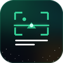

<p align="center">
  
</p>

<h1 align="center">Lumis — Image to Text with AI</h1>

<p align="center">
  <strong>Extract text instantly with AI. Built-in support for Gemini, Claude, and ChatGPT.</strong>
</p>
# ✦ Lumis — Image to Text with AI

> *Where images become words.*

**Lumis** is a premium Chrome extension that extracts text from anything on your screen — instantly. Select any area, screenshot, image, or document, and Lumis reads it, copies it, and hands it straight to the AI of your choice.

No manual typing. No switching apps. Just scan and go.

---

## ✨ What Makes Lumis Different

Most OCR tools are clunky, outdated, and slow. Lumis was built differently — with a dark premium UI, aurora firefly animations, and deep AI integration baked in from day one. It feels less like a utility and more like a tool from the future.

---

## 🚀 Features

### 🔍 Instant OCR — No Setup Required
- Draw a selection box over **any area** of your screen
- Text is extracted in under 2 seconds
- Automatically **copied to your clipboard** the moment it's detected
- Works on images, PDFs, videos, screenshots, subtitles — anything visible

### 🤖 Built-in AI Integration
- **✦ Gemini** — opens in the sidebar, ready to analyse your extracted text
- **◈ Claude** — opens in a new tab with your text pre-loaded via `?q=`
- **⬡ ChatGPT** — opens in the sidebar with your query pre-filled
- Highlight any word in your result → floating **Ask AI** button appears instantly

### 📊 Smart Usage Tracking
- Built-in free key included — **100 requests/month**, no account needed
- Upgrade to your own free OCR.space key for **25,000 requests/month**
- Live stats right in the popup: Used / Remaining / Days until reset
- Warns you at 70 uses, blocks gracefully at 100 with a direct upgrade prompt

### 🎨 Premium Aurora UI
- Deep dark background with **living firefly aurora animations**
- 13 glowing blobs — emerald, teal, cyan, amber, gold — drifting and blending
- Where two blobs overlap they **create brand new colours** using screen blend mode
- Cursor spotlight effect — the background softly reacts to your mouse
- Every blob slowly shifts its own colour over time — the UI is never the same twice
- Glassmorphism panels, Cormorant serif typography, grain texture overlay

### ⌨️ Keyboard Shortcut
- `⌘ Shift X` (Mac) / `Ctrl Shift X` (Windows) — activate from anywhere

### 📥 Export & Share
- **Download** your extracted text as a formatted HTML report with screenshot embedded
- **Google It** button — searches your extracted text directly
- Drag the result popup anywhere on screen

---

## 📦 Installation

### From Chrome Web Store *(coming soon)*
Search **"Lumis Image to Text"** on the Chrome Web Store.

### Manual Install (Developer Mode)
1. Download the latest `.zip` from [Releases](../../releases)
2. Unzip it to a folder on your computer
3. Open Chrome → go to `chrome://extensions`
4. Enable **Developer mode** (top right toggle)
5. Click **Load unpacked**
6. Select the unzipped `extension/` folder
7. ✅ Lumis is now in your toolbar

---

## 🔑 API Key Setup (Optional)

Lumis works out of the box with a built-in shared key (100/month).

For heavy use, get your own **free personal key** at [ocr.space/ocrapi/freekey](https://ocr.space/ocrapi/freekey) — it gives you **25,000 requests/month**, free forever.

Paste it into the API Key field in the popup and hit Save. That's it.

---

## 🛠 How It Works

```
User drags selection
        ↓
content.js captures screenshot via chrome.tabs API
        ↓
Canvas crops the selected region at device pixel ratio
        ↓
Cropped image (base64) → background.js
        ↓
POST to OCR.space API (Engine 2, scale, detectOrientation)
        ↓
Text returned → auto-copied to clipboard
        ↓
Result popup shown — draggable, linkified, with AI buttons
```

---

## 🤖 AI Integration Details

| AI | Method | Query Prefill |
|---|---|---|
| Gemini | Sidebar iframe | ❌ (opens ready to paste) |
| ChatGPT | Sidebar iframe | ✅ via `?q=` |
| Claude | New tab | ✅ via `?q=` on `/new` |

> Claude.ai enforces strict `frame-ancestors: none` so it cannot load inside any iframe. Lumis handles this gracefully with a branded fallback screen that opens Claude in a new tab with your text pre-loaded.

---

## 🎨 The Aurora Background — How It Works

The animated background is a custom Canvas engine (`firefly.js`):

- **13 glowing orbs** float independently across the popup
- Canvas uses **`screen` blend mode** — overlapping orbs ADD their colours, creating new shades never explicitly defined
- Each orb has its own pulse cycle, wobble trajectory, and slow colour drift
- Your cursor **repels the orbs** — they scatter gently when you hover near them
- A grain texture (`feTurbulence`, 2.5% opacity) gives it a physical, atmospheric feel

---

## 📁 File Structure

```
extension/
├── manifest.json        — MV3 config, permissions
├── background.js        — Service worker: screenshot, OCR, stats
├── content.js           — Selection UI, result popup, drag, linkify
├── popup.html           — Premium dark UI with aurora canvas
├── popup.js             — Popup logic: stats, key save, AI buttons
├── firefly.js           — Aurora canvas animation engine
├── sidepanel.html       — AI sidebar: Gemini, Claude, ChatGPT tabs
├── sidepanel.js         — Sidebar controller with Claude fallback
├── styles.css           — All in-page UI styles
├── rules.json           — Header stripping for iframe support
└── icons/
    ├── icon16.png
    ├── icon48.png
    └── icon128.png
```

---

## 🔐 Permissions Explained

| Permission | Why |
|---|---|
| `activeTab` | Access the current tab to take a screenshot |
| `scripting` | Inject the selection UI into pages |
| `storage` | Save your API key and usage count locally |
| `tabs` | Read tab info, open new tabs for Claude |
| `clipboardWrite` | Auto-copy extracted text |
| `sidePanel` | Open the native Chrome sidebar for Gemini / ChatGPT |
| `declarativeNetRequest` | Strip X-Frame-Options so Gemini and ChatGPT load in the sidebar |

> Lumis never reads your browsing history, never sends data to any server except OCR.space for text extraction, and never stores your text anywhere.

---

## 🗺 Roadmap

- [ ] Chrome Web Store public listing
- [ ] PDF page scanning
- [ ] Batch scan multiple regions
- [ ] Auto-language detection
- [ ] History of past scans
- [ ] Custom AI prompt templates

---

## 👤 About the Builder

### Neelotpala G Doddamani
**Freshman · VU (Vishwaniketan University)**

I built Lumis because I was genuinely frustrated. I was using another OCR extension that promised the same thing — scan images, get text — but it was painfully slow, constantly breaking, and felt like it was made a decade ago. I knew the technology existed to do it properly. So I decided to stop waiting for someone else to build it and do it myself.

The entire extension was built using **AI-assisted development** — with **Claude AI** as my co-pilot throughout the entire process. But here's the thing — I didn't just ask Claude to "make a Chrome extension." Every single feature was my idea. Every design decision, every UI detail, every colour, every animation, every interaction was described, directed, and refined by me through **prompt engineering**. I wrote the vision. I pushed for the premium feel. I caught what wasn't right and asked for it to be better. I iterated on every detail until it became exactly what I imagined.

This project is proof that with a clear vision and the skill to communicate it precisely, anyone — even a university freshman with no prior extension development experience — can build something genuinely great.

> *"The idea was mine. The frustration was mine. The vision was mine. Claude AI was just the fastest, most capable tool I've ever had in my hands."*

---

## 📄 License

MIT License — free to use, modify, and distribute with credit.

---

## 🙏 Credits

- OCR powered by [OCR.space](https://ocr.space) — free, fast, reliable
- Built with [Claude AI](https://claude.ai) via prompt engineering
- Typography: [Cormorant](https://fonts.google.com/specimen/Cormorant) + [Inter](https://fonts.google.com/specimen/Inter)

---

<div align="center">

**Lumis** · *Image to Text with AI* · v1.0.0

Built by **Neelotpala G Doddamani** · Freshman · VU

*Where images become words.*

</div>
